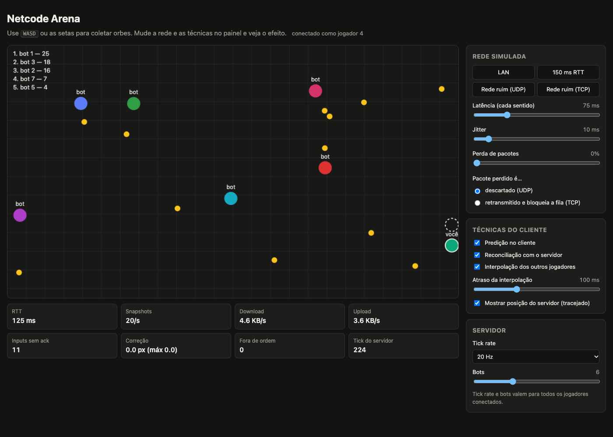
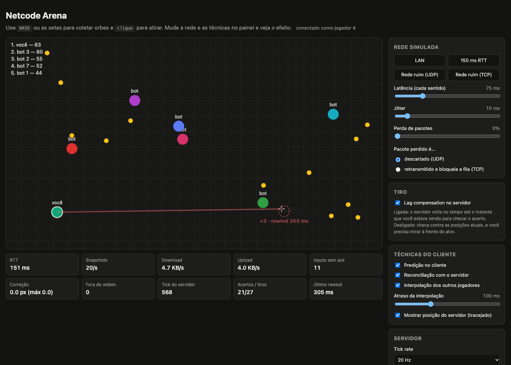

# Netcode Arena

Jogo multiplayer no navegador, com servidor autoritativo em Java, feito para **ver** as técnicas de netcode de jogos online funcionando, e o que acontece sem elas. Um painel permite simular latência, jitter e perda de pacotes, comparar o comportamento de UDP e TCP, e ligar e desligar predição, reconciliação, interpolação e lag compensation durante a partida.



Na imagem, com 150 ms de RTT, o personagem ("você") se move na hora em que a tecla é apertada, enquanto o contorno tracejado mostra onde o servidor acha que ele está: ~1 RTT atrás.



Acima, um tiro confirmado com 150 ms de RTT. O bot foi atingido onde aparecia na tela do atirador. O servidor voltou ~300 ms no tempo para checar, e o círculo vermelho tracejado marca onde ele viu o alvo. O bot já renasceu em outro lugar.

## Como rodar

Requisitos: JDK 21+.

```bash
./mvnw spring-boot:run
```

Abra http://localhost:8080, use **WASD** ou as setas para coletar orbes e **clique** para atirar nos outros jogadores e bots. Abra outra aba para ter um segundo jogador: cada aba pode ter a sua própria rede simulada.

```bash
./mvnw verify      # 33 testes: física, mundo, lag compensation, protocolo, simulador de rede e integração via WebSocket
```

## O que experimentar

| Experimento | Como | O que observar |
|---|---|---|
| **UDP contra TCP** | Presets **Rede ruim (UDP)** e **Rede ruim (TCP)**: 100 ms, jitter de 40 ms e 10% de perda | No TCP, o RTT sobe de ~216 para 350–400 ms e os snapshots chegam em rajadas. Os bots congelam e pulam. No UDP o jogo segue fluido, e a correção continua em 0 px. |
| **Sem predição** | Preset **150 ms RTT** e desmarque **Predição** | Cada tecla demora ~150 ms para ter efeito. |
| **Sem reconciliação** | Mesmo preset, desmarque só **Reconciliação** e alterne entre esquerda e direita | O personagem dá trancos para trás. **Correção** sobe de 0 para ~15–18 px. |
| **Sem interpolação** | **Tick rate** em 5 Hz e desmarque **Interpolação** | Os bots teleportam a cada 200 ms. Com interpolação ficam suaves, mas desenhados no passado. |
| **Lag compensation** | Preset **150 ms RTT**, atire em bots se movendo, com **Lag compensation** ligada e desligada | Ligada, o tiro acerta onde você vê o bot, e um círculo vermelho mostra onde o servidor o viu (~300 ms no passado). Desligada, a maioria dos tiros erra: nos testes, 15/15 contra 3 a 6 de 15. |
| **Reordenação** | Modo UDP, jitter de 100 ms | **Fora de ordem** sobe. No modo TCP fica sempre em zero. |

## Arquitetura

```
 navegador (JS)                                   servidor (Java 21 + Spring Boot)
┌──────────────────────────┐                     ┌───────────────────────────────────────┐
│ 60 inputs/s, numerados   │── binário ─────────►│ uplink simulado ──► fila de inputs    │
│ predição + reconciliação │                     │   (latência, jitter, perda,           │
│ interpolação dos outros  │◄─ binário ──────────│    modo UDP ou TCP)                   │
│ painel (JSON de controle)│◄─► JSON ───────────►│ downlink simulado ◄── snapshot/tick   │
└──────────────────────────┘     WebSocket       │                                       │
                                                 │ game-loop: tick fixo, mundo, bots     │
                                                 │ net-sim:   entrega e envio            │
                                                 └───────────────────────────────────────┘
```

- **O servidor decide tudo.** O cliente envia só inputs ("apertei direita no input 1042"), nunca posições.
- **O tick é fixo** (20 Hz por padrão) e **os inputs são de passo fixo** (60/s, 1/60 s cada). A física é a mesma, determinística, no Java e no JavaScript.
- **O protocolo é binário** para inputs e snapshots: 236 bytes por snapshot com 7 jogadores e 12 orbes, contra ~962 em JSON. O controle é JSON.
- **O tiro tem lag compensation:** o cliente informa o tick que estava vendo, e o servidor volta no tempo até ele, com um histórico de posições do último segundo, para checar o acerto.
- **Inputs são reenviados** até o servidor confirmar (`ackSeq` no snapshot). Isso torna a perda de pacotes inofensiva sem usar retransmissão.
- **O simulador de rede** fica no servidor e aplica latência, jitter e perda a cada mensagem, imitando o que UDP (descarta e pode reordenar) e TCP (retransmite e bloqueia a fila) fazem com um pacote perdido.

## Documentação das decisões

O raciocínio por trás de cada parte está em ADRs (*Architecture Decision Records*), com explicação detalhada, alternativas descartadas, consequências e como verificar cada comportamento no jogo:

| ADR | Tema |
|---|---|
| [0001](docs/adr/0001-servidor-autoritativo-com-tick-fixo.md) | Servidor autoritativo com tick fixo |
| [0002](docs/adr/0002-websocket-com-simulador-de-rede.md) | WebSocket como transporte e o simulador de UDP e TCP |
| [0003](docs/adr/0003-protocolo-binario-e-json-de-controle.md) | Protocolo binário, byte a byte |
| [0004](docs/adr/0004-inputs-sequenciados-e-redundantes.md) | Inputs numerados e reenviados até o ack |
| [0005](docs/adr/0005-fisica-deterministica-compartilhada.md) | Física determinística compartilhada entre Java e JavaScript |
| [0006](docs/adr/0006-predicao-e-reconciliacao.md) | Predição e reconciliação no cliente |
| [0007](docs/adr/0007-interpolacao-de-entidades-remotas.md) | Interpolação dos outros jogadores |
| [0008](docs/adr/0008-modelo-de-threads.md) | Modelo de threads: uma dona do mundo, outra da rede |
| [0009](docs/adr/0009-fora-do-escopo-e-proximos-passos.md) | O que ficou de fora (delta compression, salas, reconexão...) |
| [0010](docs/adr/0010-tiro-com-lag-compensation.md) | Tiro instantâneo com lag compensation |

O [glossário](docs/glossario.md) define os termos usados no jogo, no painel e nos ADRs: tick, snapshot, input, ack, RTT, jitter, head-of-line blocking, predição, reconciliação, interpolação, lag compensation, rewind e outros.

## Estrutura

```
src/main/java/br/com/diegobraun/netcode
├── game/   GameWorld, Player, Physics, constantes (sem dependência de rede)
└── net/    GameServer (loop e conexões), Protocol (binário), SimulatedLink, handler WebSocket
src/main/resources/static
├── index.html, style.css
└── js/     main.js (loop, predição, reconciliação, interpolação, painel), physics.js, protocol.js
docs/adr/   decisões de arquitetura
docs/glossario.md
```

## Configuração

```yaml
game:
  tick-rate: 20   # 5, 10, 20, 30 ou 60
  bots: 3         # 0 a 20
```

Os dois também podem ser alterados no painel, e a mudança vale para todos os jogadores conectados.

## Licença

[MIT](LICENSE)
